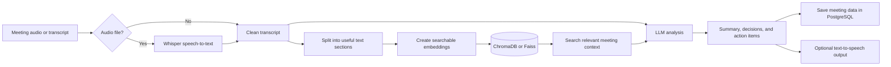

# DeepMeet

DeepMeet is an AI-powered meeting assistant. It turns a meeting recording or transcript into useful notes, so people can spend less time writing minutes and more time acting on the discussion.

The planned application can:

- turn spoken audio into text;
- create a short summary of the meeting;
- identify decisions, action items, and important topics;
- let users search questions and answers from past meetings; and
- read results aloud when audio output is useful.

## How It Works

DeepMeet follows a simple pipeline:



### Step-by-step flow

1. **Input:** A user uploads a meeting recording or provides a transcript.
2. **Transcription:** If the input is audio, Whisper converts the speech into text.
3. **Preparation:** DeepMeet cleans the transcript and divides it into smaller sections that are easier to process and search.
4. **Storage for search:** The sections are converted into embeddings and stored in ChromaDB or Faiss. This makes it possible to find the most relevant parts of a meeting later.
5. **AI analysis:** An LLM uses the transcript and relevant search results to generate a summary, decisions, topics, and action items.
6. **Persistent storage:** Meeting records and generated results are stored in PostgreSQL.
7. **Results:** The user can read the notes, ask questions about the meeting, or optionally listen to the response through text-to-speech.

## Technology Stack

- **Python:** Main programming language.
- **Whisper:** Converts meeting audio into a transcript.
- **OpenAI API or Ollama:** Provides the language model used for summaries and questions.
- **PostgreSQL:** Stores meetings, transcripts, summaries, and action items.
- **ChromaDB or Faiss:** Stores vector embeddings for semantic search.
- **Edge TTS or Kitten-TTS:** Converts generated text into speech.

## Project Status

DeepMeet is currently in the early setup stage. The repository contains the project documentation and technology choices, while the application code and runtime dependencies are still to be added.

## Getting Started

The project will be runnable after the application code and dependencies are committed. The intended setup is:

```bash
git clone <repository-url>
cd DeepMeet

python -m venv .venv
```

Activate the virtual environment:

**Windows PowerShell**

```powershell
.venv\Scripts\Activate.ps1
```

**macOS/Linux**

```bash
source .venv/bin/activate
```

Install the project dependencies when they are available:

```bash
pip install -r requirements.txt
```

Depending on the selected AI provider, the final setup will also require PostgreSQL, an OpenAI API key or a local Ollama model, and configuration values for the chosen speech and vector-search services.

## License

See [LICENSE](LICENSE) for license information.